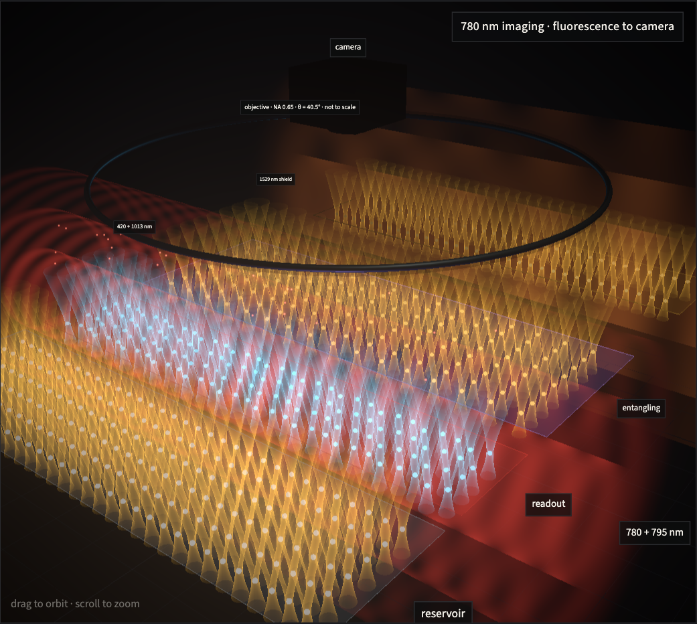
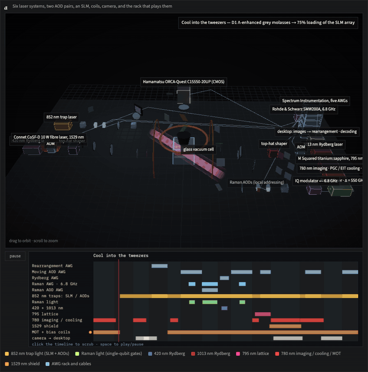
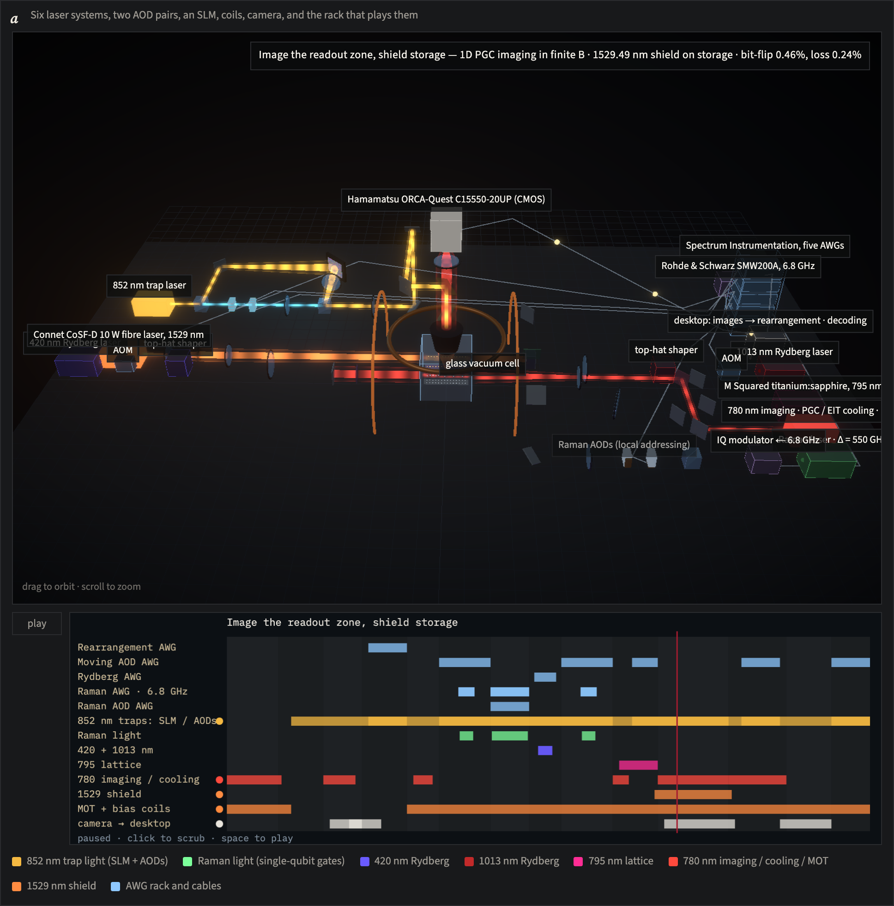
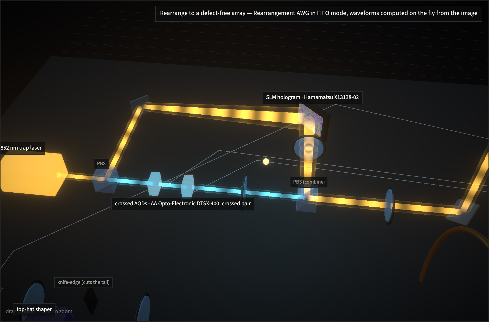
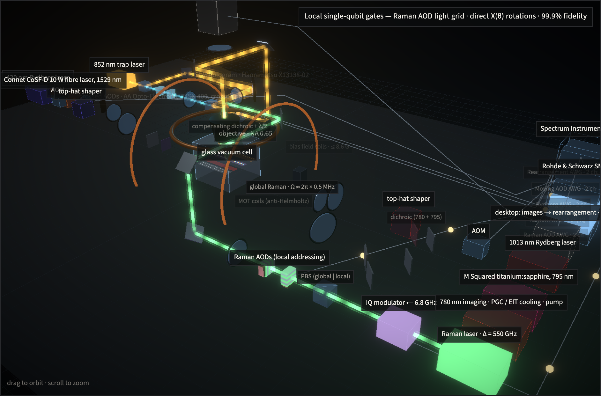
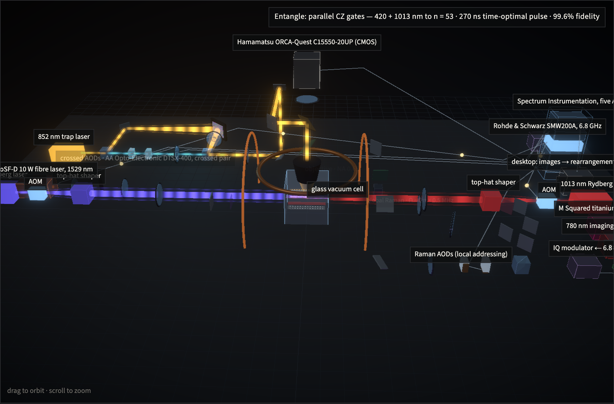
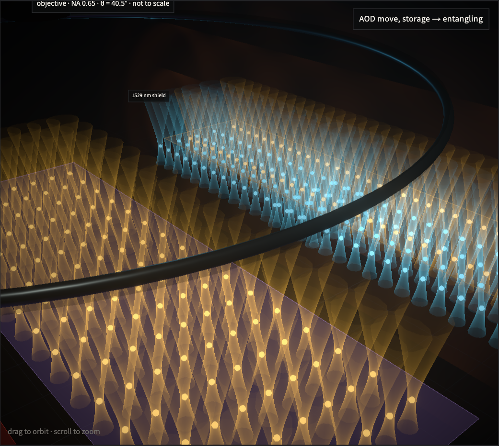
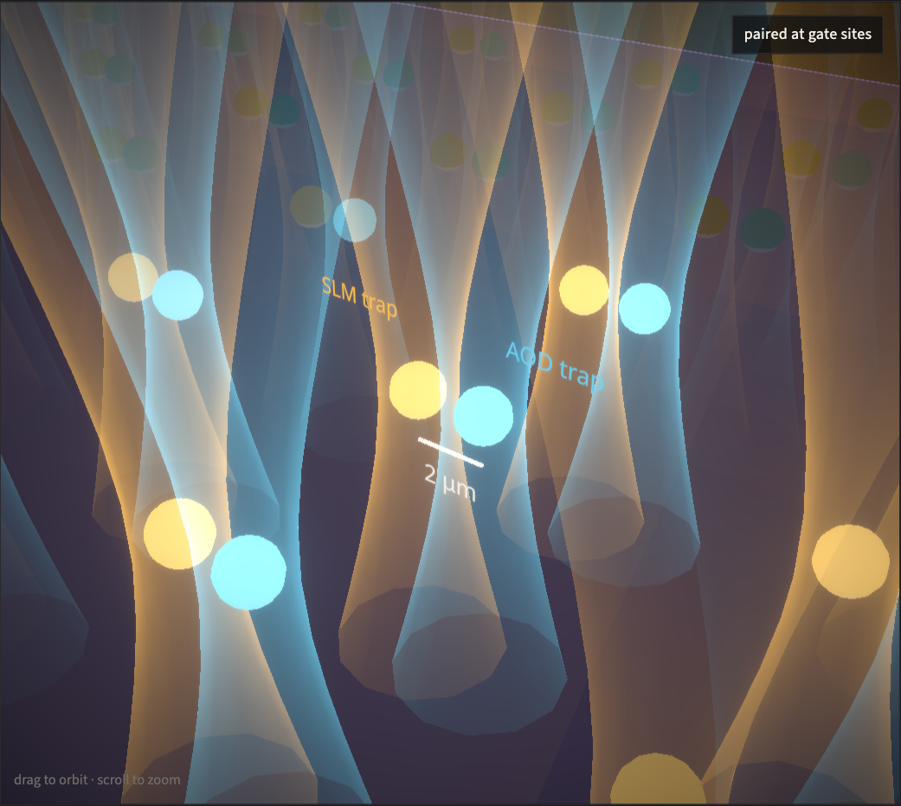
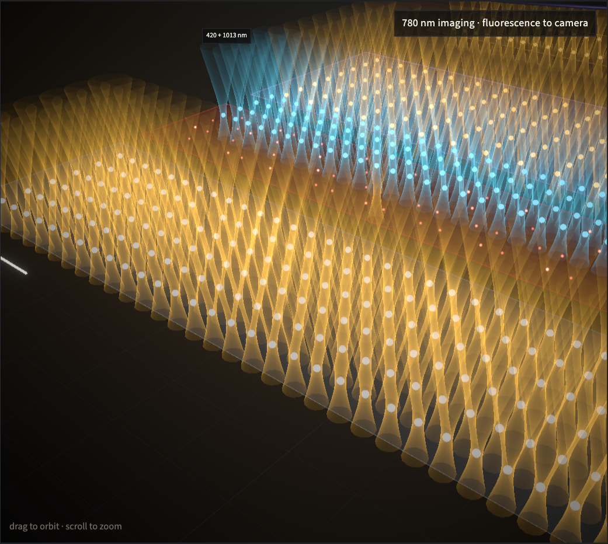
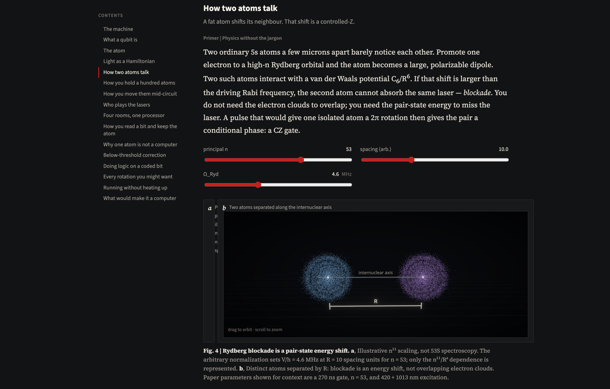

# How to build a quantum computer out of atoms

**Live site:** [https://luke-mcevoy.github.io/neutral-atom-compute-visualizer/](https://luke-mcevoy.github.io/neutral-atom-compute-visualizer/)

<p align="center">
  
</p>

A plain-English, interactive guide to [Bluvstein, Geim et al., *Nature* **649**, 39–46 (2026)](https://doi.org/10.1038/s41586-025-09848-5) — the Harvard–MIT experiment that ran a reconfigurable array of up to **448 ⁸⁷Rb atoms** as the working pieces of a universal, fault-tolerant quantum processor.

Read it as a “dummies guide” that never dumbs down the numbers. The figures move. Every displayed quantity is taken from the paper or computed from a formula stated there.

[**Open the guide**](https://luke-mcevoy.github.io/neutral-atom-compute-visualizer/) · [Paper](https://www.nature.com/articles/s41586-025-09848-5) · [DOI](https://doi.org/10.1038/s41586-025-09848-5) · [Zenodo data](https://doi.org/10.5281/zenodo.15685795)

---

## How to read it

Every chapter is written in three layers. You choose your depth:

1. **Level 1 — Plain English.** No science background assumed. Read only these amber boxes, top to bottom, and you will understand the whole machine.
2. **Level 2 — The physics.** The actual mechanism, for the curious.
3. **Level 3 — What the paper measured.** The experiment’s own numbers, each tagged to a figure or Methods line.

Arrow keys jump between chapters. Drag to orbit the 3D boards; use the numbered steps under a figure to walk through it.

---

## Public paper only — no insider information

This is an **unofficial** explainer of a **published** article. It is not affiliated with Springer Nature or the authors.

- Every number, claim, and figure is from Bluvstein, Geim et al., *Nature* **649**, 39–46 (2026) or from a formula in that paper or its public supplement.
- There is **no insider information**: nothing unpublished, nothing from private communication with the authors, and no laboratory access beyond the paper.

---

## Demo

<p align="center">
  
  <br />
  <em>The instrument playing one layer of a computation, live. Each tour step re-aims the camera at one subsystem — trap SLM + AODs, loading and the first picture, Raman single-qubit gates, the 420 + 1013 nm entangling flash, readout, and inside the cell — while the timeline underneath shows which AWG channel and laser is on. <a href="https://luke-mcevoy.github.io/neutral-atom-compute-visualizer/#control">Open it live</a> to orbit, scrub and step through yourself.</em>
</p>

<p align="center">
  
  <br />
  <em><strong>Fig. 8, “The whole instrument, running one layer.”</strong> Every piece of hardware the paper names, on one table, playing one layer of a quantum computation: the 852 nm trap laser split between the Hamamatsu SLM and the crossed AA Opto-Electronic AODs; the Raman laser, IQ modulator and Rohde &amp; Schwarz 6.8 GHz source; the 420 + 1013 nm Rydberg lasers from either side; the M Squared 795 nm lattice and 780 nm imaging light; the 10 W 1529 nm shield; MOT and bias coils; the NA-0.65 objective and ORCA-Quest camera; and the rack of five Spectrum AWGs whose pulses run down the cables. A box glows only while it fires. The timeline below is the same program the 3D scene is playing — scrub it, and a nine-step tour re-aims the camera at each subsystem.</em>
</p>

<p align="center">
  
  <br />
  <em>Holding the atoms: one 852 nm laser, a polarizing beam-splitter, the SLM writing the static array as a hologram, the crossed AOD pair making the movable traps, recombined and sent up the periscope to the objective.</em>
</p>

<p align="center">
  
  <br />
  <em>Single-qubit gates: the Raman laser’s global arm covering the array and the local arm through a second 2D AOD pair, compensating dichroic and half-wave plate, while the Raman AWG writes the light grid.</em>
</p>

<p align="center">
  
  <br />
  <em>The entangling flash: 420 nm and 1013 nm light counter-propagating into the cell for the 270 ns CZ, gated by the Rydberg AWG.</em>
</p>

<p align="center">
  
  <br />
  <em><strong>Fig. 1, “The processor, drawn in light.”</strong> The whole machine at one scale (1 unit = 20 μm): four zones sized from the paper’s Methods, ~500 atoms drawn (the reservoir is shown full, so slightly more than the paper’s maximum of 448), each held in an 852 nm Gaussian tweezer whose hourglass is w(z) = w₀√(1 + (z/z_R)²). Here a block of 128 atoms in cyan AOD traps glides from storage into the entangling zone.</em>
</p>

<p align="center">
  
  <br />
  <em>Close-up on one gate site during the 270 ns CZ: the two atoms 2 μm apart (a spacing inherited from the group’s earlier gate paper, not restated in this one), the 420 + 1013 nm sheets sweeping through, and the blockade radius R_b = (C₆/ħΩ)^{1/6} ≈ 4.4 μm — swallowing the partner, missing the next site 11 μm over.</em>
</p>

<p align="center">
  
  <br />
  <em>Readout: 780 nm imaging light along the rows, photons leaving isotropically, and only the (1 − cos θ)/2 = 12% inside the NA-0.65 cone climbing to the objective.</em>
</p>

<p align="center">
  
  <br />
  <em>One layer of the cycle as choreography — scrub the timeline or watch it play: interleave, 270 ns CZ, readout, reset, refill from the reservoir.</em>
</p>

<p align="center">
  
  <br />
  <em>The valence electron as a Monte Carlo sample of |ψ|², with the radial density r²R²(r).</em>
</p>

<p align="center">
  
  <br />
  <em>Rydberg blockade is a pair-state energy shift — not overlapping electron clouds.</em>
</p>

---

## What it is

A long-form article you can operate.

- **Three reading levels** in every section: plain English for everyone, the physics for the curious, and exactly what the paper measured.
- **Live figures:** the whole optical table — every laser, modulator, coil, camera and signal generator the paper names — animated through one layer of a computation with a synchronized instrument timeline; the processor and every beam in it at true scale as a guided 3D tour; 3D |ψ|² clouds, an animated Bloch sphere you drive with laser pulses, integrated two-atom blockade dynamics, a scrubbable machine cycle, SLM holograms, AOD shuttling, surface-code patches, the below-threshold bar chart, the 45° magic-state plateau.
- **Grounded claims:** 448 atoms, n = 53, 270 ns CZ, 2.14(13)× lower error at d = 5 than d = 3 on a four-round circuit — each tagged to a figure or Methods line.

Sixteen chapters, from the atom to a running fault-tolerant machine:

The machine · What a qubit is · The atom · Light is the toolbox · How two atoms talk · How you hold a hundred atoms · How you move them mid-circuit · Who plays the lasers · Four rooms, one processor · How you read a bit and keep the atom · Why one atom is not a computer · Proof that bigger is quieter · Doing logic on a coded bit · Every rotation you might want · Running without heating up · What would make it a computer

### Foundations

The guide explains a machine; it is not the place to derive hyperfine structure or the AC Stark shift. Those concepts live in a separate set of pages at [`#/foundations`](https://luke-mcevoy.github.io/neutral-atom-compute-visualizer/#/foundations), built from first principles in the same three levels with the same kind of live figures. Dotted links in the guide (`hyperfine↗`) jump to the relevant section. Nothing on those pages is from the paper — it is standard atomic and quantum physics with the source stated (Steck's *Rubidium 87 D Line Data*, CODATA), and every derived number is recomputed live and covered by tests.

Available: **Inside the rubidium atom** — the level ladder zoomed from optical (384 THz) through fine (7.1 THz) and hyperfine (6.83 GHz) structure; a 3D vector model of how the nuclear and electron spins couple into F and precess about a field to give m_F; the exact Breit–Rabi fan of the eight ground sublevels with the 575.15 Hz/G² clock-state curvature; and a Ramsey dephasing picture that turns the 8.6 G field sensitivity into a memory time (a clock qubit keeps its phase ~71× longer than an m_F = ±1 qubit under the same field noise).

Planned, in dependency order: a qubit physically · what light does to an atom · cooling and seeing atoms · Rydberg atoms · entanglement and two-qubit gates · why error correction can work at all.

---

## Scientific accuracy

Everything on screen is one of three things, and the captions say which:

1. **A paper number.** Atom counts, zone dimensions, wavelengths, beam waists, gate time, detunings, fidelities, error rates, durations, decoder details. Each carries a figure or Methods tag. These live in one file, `src/data/paper.ts`, so they can be audited against the article in one sitting.
2. **A computation from a stated formula.** Gaussian-beam envelopes (z_R = πw₀²/λ), the fluorescence collection fraction ((1 − cos θ)/2 for NA = sin θ), Rabi and light-shift scalings, the two-atom blockade Schrödinger integration, quantum-defect orbital radii (n* = n − δ_ℓ with the standard Rb defects). Code in `src/physics/`.
3. **A drawn assumption**, always labelled. The ones that matter: the tweezer waist (1 μm; the paper does not quote it), the blockade radius (C₆ from the published n*¹¹ scaling anchored on Rb 70S — not a paper value), the objective and camera placed 60 μm above the atoms instead of millimetres, an 8× exaggerated lattice period, illustrative photon speeds and counts, and display colours for infrared beams.

   For the instrument table (Fig. 8): the **component list, wavelengths, detunings, durations, fidelities and which AWG drives what** are the paper’s (Methods: system overview, spin-to-position conversion, 1D imaging and cooling, the 1,529 nm shielding beam, local single-qubit gates; Extended Data Fig. 1b). The **layout of the table, beam routing, component sizes and the pacing of the animated run** are a schematic reconstruction from the text — the paper’s Extended Data Fig. 1a is the real optical layout. The run program lives in `src/data/program.ts`; each phase carries the paper fact it is standing in for, and the phase label on the stage shows it while that phase plays.

The text was audited line by line against the main text and Methods. Two things the earlier draft got wrong and this version fixes, in case you compared: the surface-code benchmark parks used ancilla blocks in storage and reads them all out at the end (“delayed erasure”) rather than measuring every round — per-layer measure-and-reuse is the deep-circuit architecture of Figs. 5–6; and the Rb 5s ground-state radius is set by a quantum defect (n* ≈ 1.87), so the Rydberg atom is ~700× larger, not the hydrogenic ~100× or a round “thousand”.

If you find a number that does not trace to the paper or to a stated formula, it is a bug — please open an issue.

### Checked, not just asserted

- **Claims ledger.** [`docs/CLAIMS.md`](docs/CLAIMS.md) lists every constant in `src/data/paper.ts` with the section of the paper that states it and a verbatim fragment. It is generated from `src/data/provenance.ts` (`npm run ledger`), and a test fails if any constant lacks an entry. With `PAPER_TXT=/path/to/paper.txt npm test` (a `pdftotext` dump of the open-access PDF, not redistributed here), the suite also checks that every quoted fragment really appears in the paper.
- **Physics tests.** `npm test` runs golden tests against closed-form results: Rayleigh limit and collection fraction for NA 0.65, Gaussian-beam z_R and w(z), blockade-radius scaling, the Rb 5s radius from the quantum defect and the ≈700× 53S/5s ratio, hydrogenic normalisation and node counts, and the two-atom blockade integrator (probability conservation; P_rr = sin⁴(Ωt/2) without interaction; √2 Ω collective oscillation and <1 % double excitation deep in blockade). The run program behind Fig. 8 is checked for phase tiling and for hardware constraints such as the two Rydberg colours always firing together. The Foundations hyperfine module is checked against Steck: zero-field Breit–Rabi reproduces the F = 1, 2 energies, Landé g_F ≈ ±½, the 0.70 MHz/G and 1.40 MHz/G linear slopes, the 575.15 Hz/G² clock coefficient (and 42.5 kHz at 8.6 G), the traceless Zeeman sum over all eight sublevels at any field, and the Paschen–Back limit.

---

## Run locally

```bash
git clone git@github.com:luke-mcevoy/neutral-atom-compute-visualizer.git
cd neutral-atom-compute-visualizer
npm install
npm run dev
```

Opens on [http://127.0.0.1:5200/](http://127.0.0.1:5200/).

In the Optics Studio monorepo the same app lives at `packages/defense`:

```bash
npm run dev --workspace @optics/defense
```

A production snapshot is also served from the personal site at `/defense/`.

---

## Deploy

The public site is **GitHub Pages**, rebuilt automatically on every push to `main`.

| | |
| --- | --- |
| URL | https://luke-mcevoy.github.io/neutral-atom-compute-visualizer/ |
| Repo | https://github.com/luke-mcevoy/neutral-atom-compute-visualizer |
| Workflow | `.github/workflows/pages.yml` — install, typecheck, test, Vite build, `actions/deploy-pages` |
| Pages source | **GitHub Actions** (repo Settings → Pages) |

After a push, the new build is live within a couple of minutes. If 3D figures ever look clipped into a corner, hard-refresh (Cmd+Shift+R); the canvases must fill their panels, not size themselves with `height: auto`.

---

## Cite the paper

Bluvstein, D., Geim, A.A., Li, S.H. et al. A fault-tolerant neutral-atom architecture for universal quantum computation. *Nature* **649**, 39–46 (2026). https://doi.org/10.1038/s41586-025-09848-5
